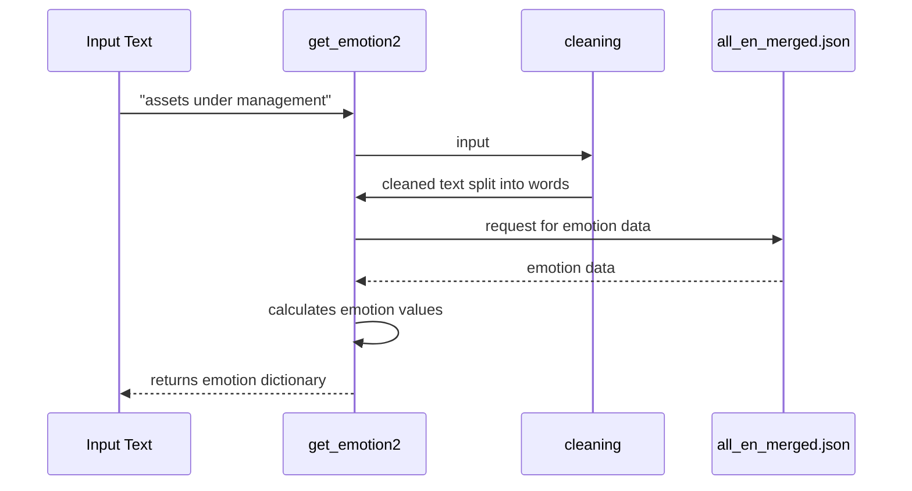

  # A Dive into the FinEmotion Annotation Algorithm: Enhancing Financial Market Analysis through Emotion Recognition


Welcome to the new open-source project from the AI4Finance Foundation, an open-source community sharing AI tools for finance. This blog post introduces FinEmotion, a novel Python library for annotating emotions in financial texts, recently developed and made available by AI4Finance Foundation. We will guide you through the building blocks of the library and illustrate how it can revolutionize financial text analysis.

FinEmotion is built upon the solid foundation of Text2Emotion and improved to incorporate all of Plutchik's Wheel of Emotions, which postulates eight primary emotions: joy, trust, fear, surprise, sadness, anticipation, anger, and disgust. In addition, the emotion mixing of 24 emotions. It uses a combination of a sentiment lexicon and a proprietary financial corpus to identify and quantify these emotions within financial text.


## Making of the Improved Algorithm 

### 1. Expansion of Sentiment Lexicon:

We began by expanding the sentiment lexicon, which provides the fundamental building blocks for our algorithm. It helps in identifying the emotions present in a given text. However, financial text often contains industry-specific jargon, necessitating the use of a more tailored lexicon. We expanded the lexicon by integrating a financial corpus. Our expanded lexicon can thus recognize a wider range of emotions, especially those specific to financial contexts.  Our corpus has 19,430 words and phrases compared to the original 8,666.


### 2. Incorporation of Multi-Word Phrases:

Beyond single-word entries, our algorithm considers multi-word phrases, crucial in financial contexts. For instance, phrases such as 'assets under management' or 'market correction' carry specific connotations in financial texts. Incorporating such phrases into our emotion annotation process allows us to capture a richer emotional landscape.

To explain the multi-word phrase inclusion, consider the following sequence diagram of the get_emotion2 function in our library:



The function cleans the input text and splits it into words. For each word, it looks for matching entries in the emotion data, considering both single-word and multi-word phrases starting with the given word. It returns an emotion dictionary representing the emotions found in the input text.


## Utilizing the get_emotion Function

Our algorithm provides two key functions: get_sentiment and get_emotion. The 'get_sentiment' function analyzes the sentiment of your input text, which is a crucial initial step in our emotion analysis. This sentiment analysis acts as a guide to understand the overall context of the text, laying the groundwork for a more refined emotion annotation.

Understanding the sentiment of the text allows the algorithm to give more weight to emotions that align with the identified sentiment. For instance, if the sentiment analysis determines the text to have a negative sentiment, the algorithm will place more emphasis on emotions that fall within the negative band, such as anger or sadness. This incorporation of sentiment analysis adds a layer of context that significantly improves the accuracy and relevance of the emotion annotation.

Following the sentiment analysis, the 'get_emotion' function provides a breakdown of the different emotions present in the text. The function accepts the input text and the identified sentiment to deliver an emotion dictionary that quantifies the prevalence of different emotions in the text.

Here is how you can use these functions:

```python
!python -m spacy download en_core_web_sm
from finemotion import emotion

# your input text
input = "The stock market is extremely volatile today!"

# get the sentiment
sentiment = emotion.get_sentiment(input)

# get the emotion
emotion = emotion.get_emotion(input, sentiment)
print(f'Emotion: {emotion}')
```

The dictionary output represents the emotion annotation, an invaluable tool for understanding emotional undertones present in financial news articles that can impact investment decisions. The dictionary displays the prevalence of the eight primary emotions identified in Plutchik's model: fear, anger, trust, surprise, sadness, disgust, joy, and anticipation. Each emotion is associated with a numeric value representing its prevalence in the analyzed text. For instance, a text may have a high prevalence of 'fear' and 'anticipation', providing useful insights into the emotional undercurrent of the text.

## Addressing Emotion Mixing

Beyond recognizing individual emotions, our algorithm also addresses the challenge of emotion mixing, where a sentence or paragraph may elicit multiple emotions. For instance, news of a stock market crash might elicit fear due to potential financial loss, but also anticipation for buying opportunities. The `get_mixed_emotion` function addresses this complexity by providing a breakdown of all emotions present in the text:

```python
# your input text
input = "The stock market is extremely volatile today, causing both fear and excitement among traders."

# get the mixed emotion
mixed_emotion = emotion.get_mixed_emotion(input)
print(f'Mixed Emotion: {mixed_emotion}')
```


## Conclusion

By developing an open-source library that leverages AI and ML techniques, we aim to augment the way we understand financial texts. We believe that emotion recognition in financial texts could provide valuable insights to individuals, financial institutions, and policymakers. By understanding the underlying emotions in financial news, we can better predict market trends and make more informed investment decisions.

This library was used in the following research paper:

McCarthy, S.; Alaghband, G. Enhancing Financial Market Analysis and Prediction with Emotion Corpora and News Co-Occurrence Network. J. Risk Financial Manag. 2023, 16, 226. [DOI](https://doi.org/10.3390/jrfm16040226)

### Contributing

Contributions are always welcome. We value the power of diverse ideas and perspectives and believe that our project can benefit from them. If you have ideas for improvements or notice any bugs, please feel free to fork the repository and create a pull request. 

Before making any significant changes, we recommend that you first open an issue to discuss the proposed changes. This helps us keep track of what changes are being made and why, and allows us to provide feedback and guidance. 

When you're ready to submit your changes, please ensure that your code adheres to our coding style guidelines and that any new functionality includes appropriate tests. 

Visit us on GitHub: [AI4Finance Foundation](https://github.com/AI4Finance-Foundation)
